# Pocket Sense

[](../../releases/latest)
[](../../actions/workflows/release.yml)
[](LICENSE)


A private personal finance tracker for Android and Linux. It works fully offline, in Jordanian dinars, in English and Arabic.

There are no accounts and no servers. Your data stays in an encrypted database on your device. It leaves only as an encrypted backup you make or turn on, or, if you turn on sync, encrypted to your own paired devices on your Wi-Fi.

## Screenshots

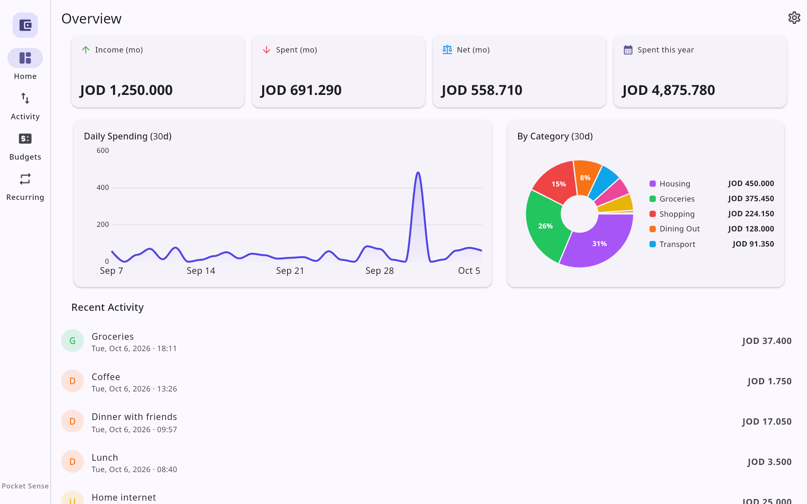

| Home | Activity | New entry | Budgets | Recurring |
|---|---|---|---|---|
| 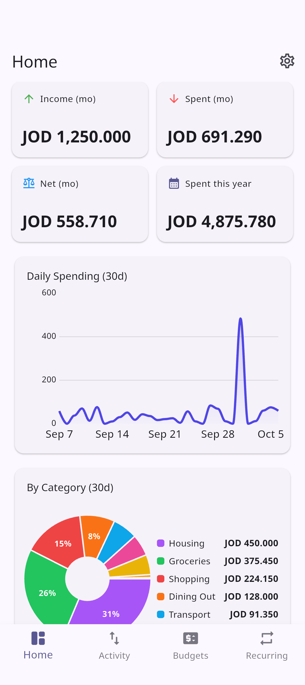 | 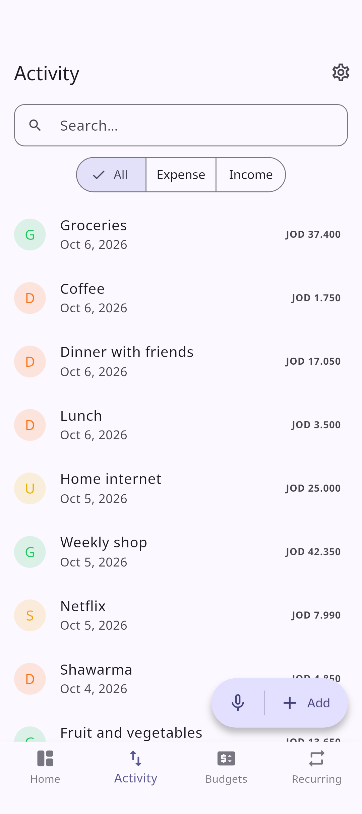 | 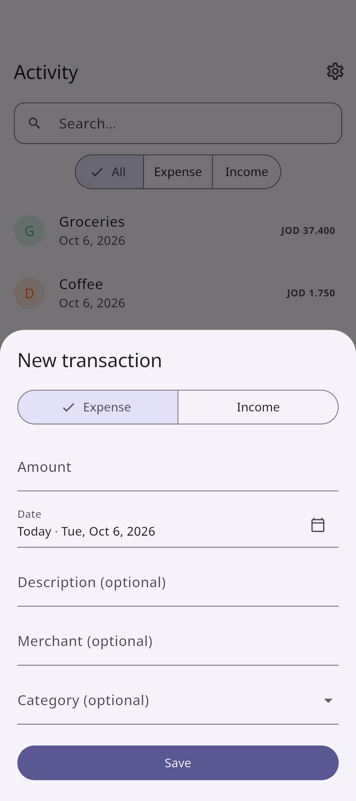 | 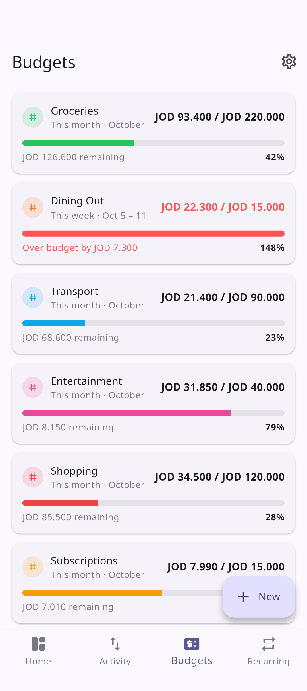 | 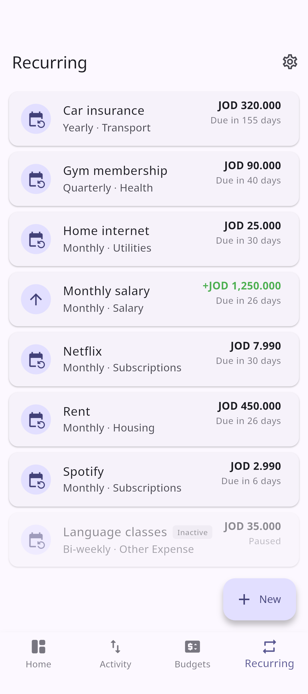 |

<details>
<summary>More: sync, Arabic, and the desktop layout</summary>

| Settings → Sync | Pairing |
|---|---|
| 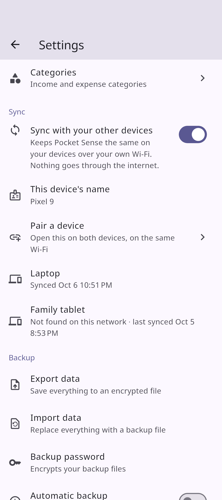 | 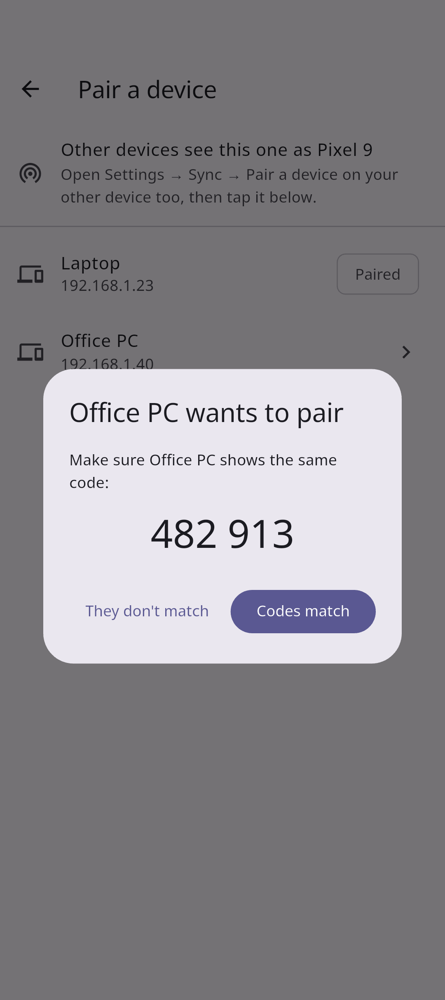 |

| الرئيسية | الحركات | الميزانيات | الإعدادات |
|---|---|---|---|
| 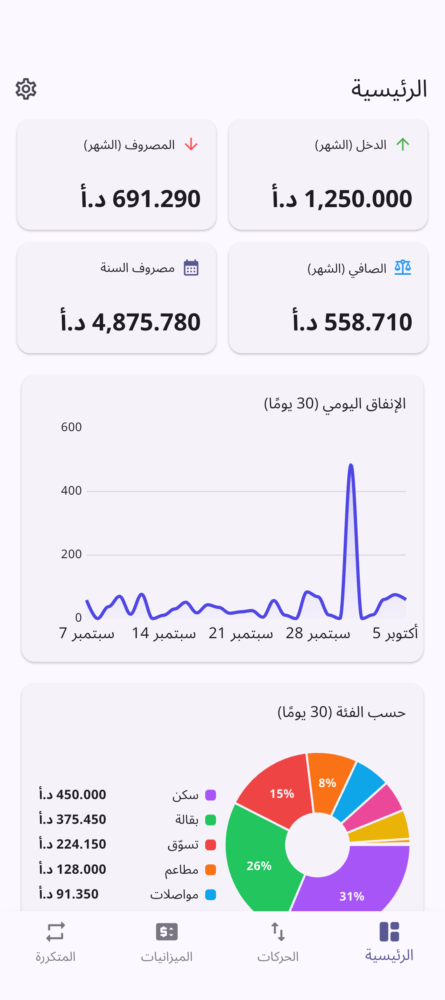 | 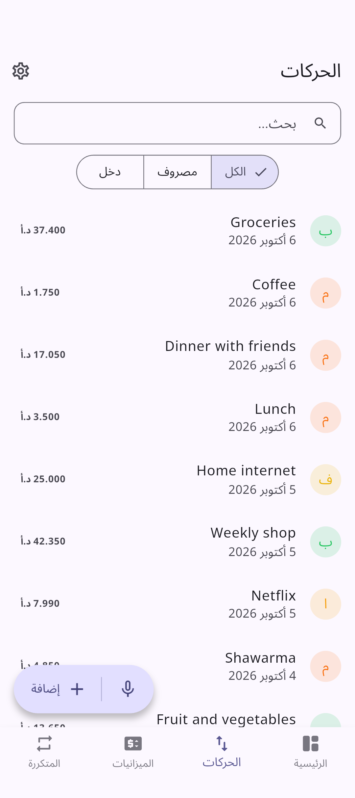 | 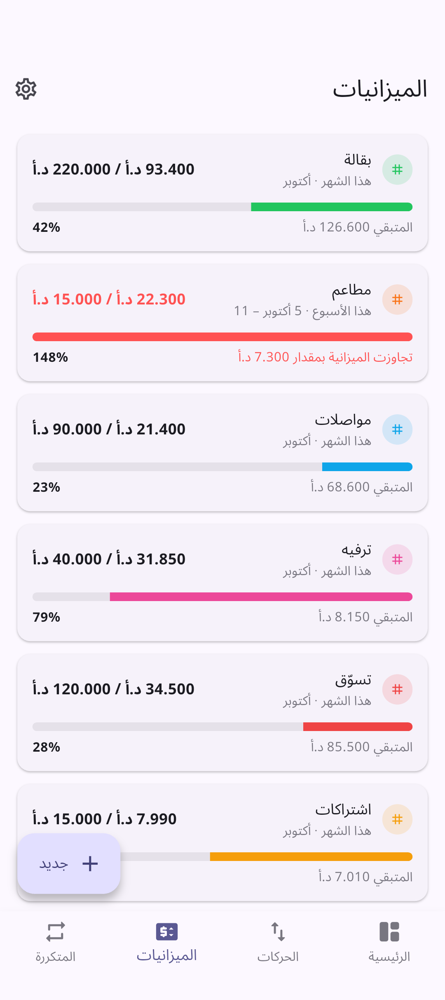 | 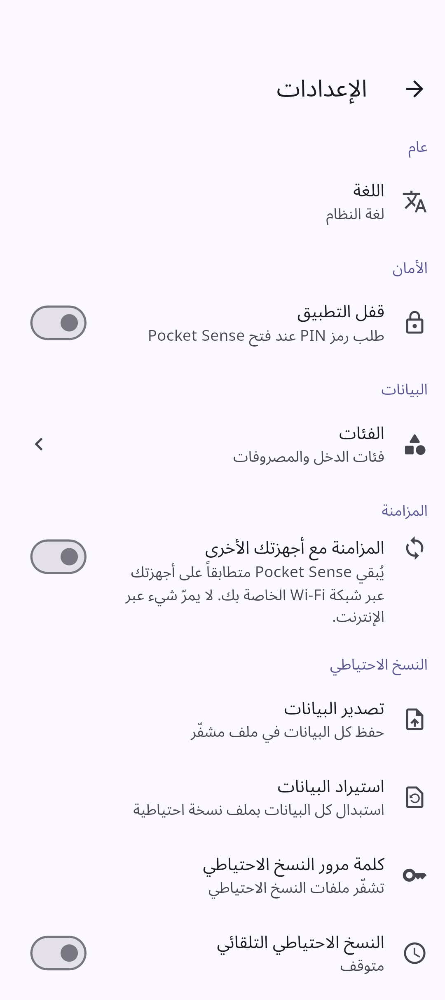 |

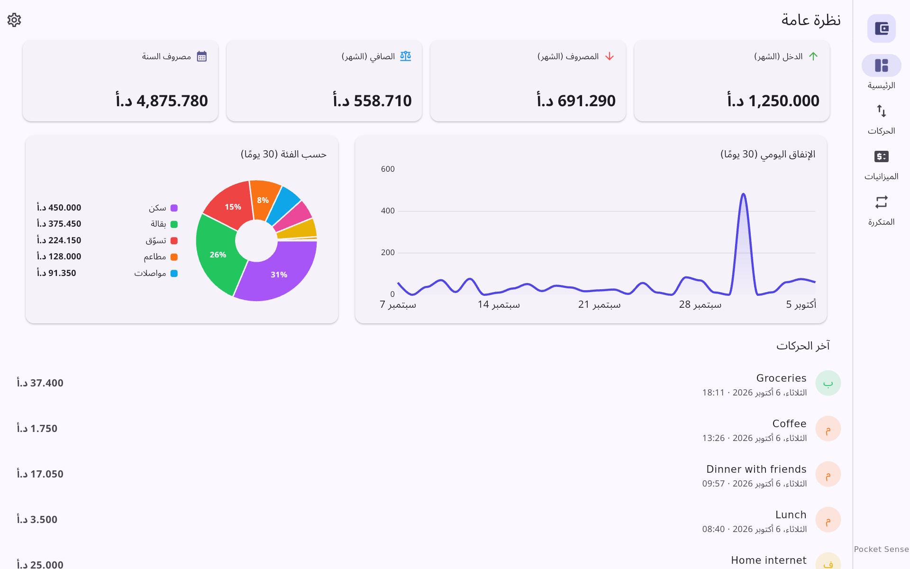
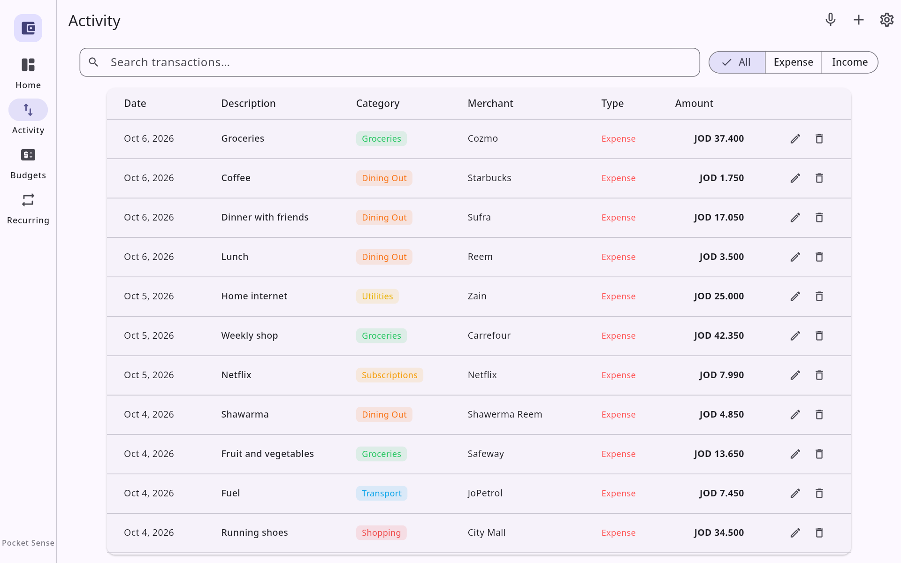
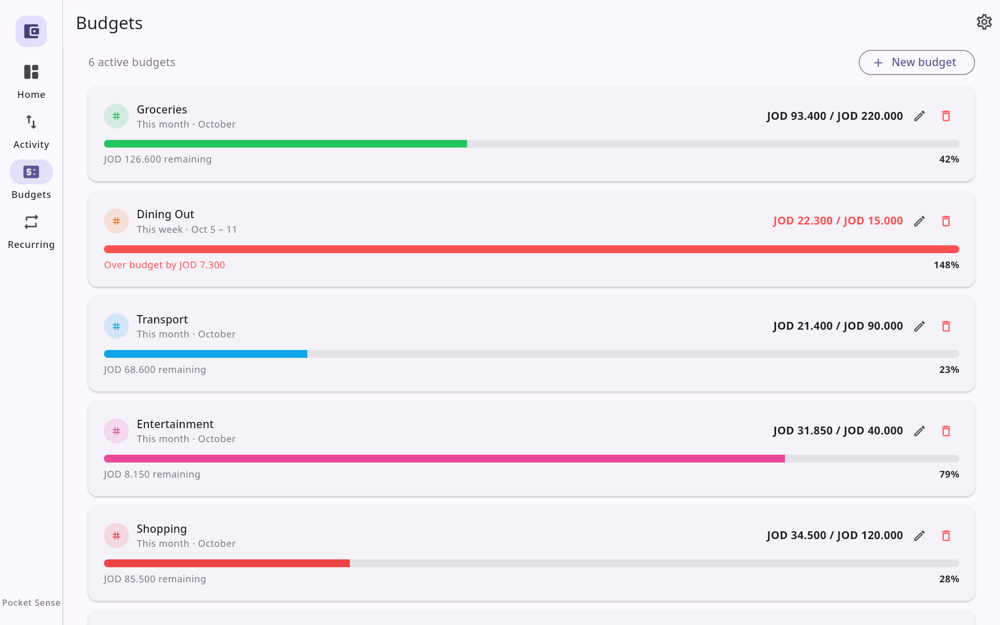
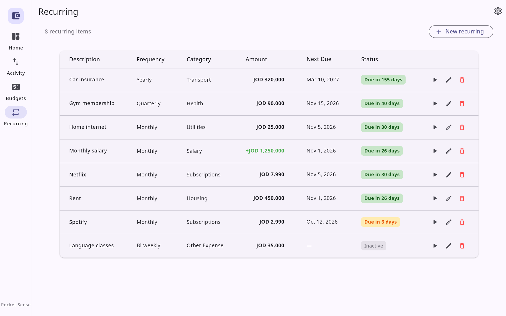
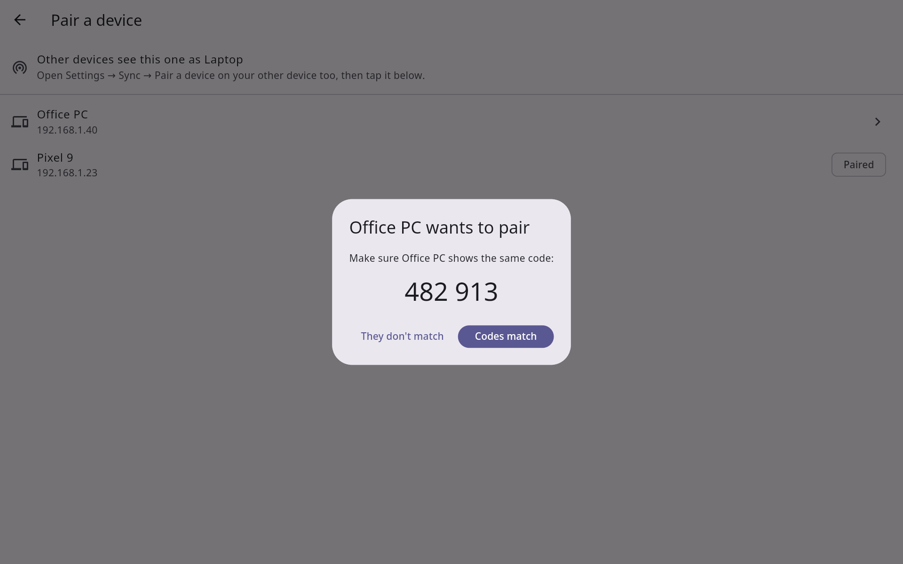

</details>

The screenshots use the demo data in [`docs/demo-backup.json`](docs/demo-backup.json). Import it from **Settings → Backup → Import data** to try the app with three months of entries.

## Features

**Tracking money**
- **Home:** this month's income, spending and net, spending so far this year, a 30-day daily spending chart, a breakdown by category, and recent entries.
- **Activity:** income and expenses with a date, description, merchant and category. Search, filter by type, tap to edit, swipe to delete, long-press for more. On the desktop it's a table with edit and delete buttons on each row.
- **Add by voice:** tap 🎤 and say *"Spent 3.5 on lunch at Reem yesterday"*. The form opens filled in for you to check and save. Voice entry understands English, in either app language.
  - On Android it uses the phone's speech recognizer.
  - On Linux it runs an offline model ([sherpa-onnx](https://github.com/k2-fsa/sherpa-onnx), about 45 MB, downloaded once on first use).
- **Budgets:** a weekly (Monday to Sunday) or monthly limit per expense category, with progress, what's left, and a warning when you go over.
- **Recurring:** bills, subscriptions and salary, repeating weekly, every two weeks, monthly, quarterly or yearly from a first due date. Each shows when it's next due. **Post as transaction** records it in one tap, and an item can be paused instead of deleted.
- **Categories:** **Settings → Categories** adds, renames, recolors and deletes income and expense categories. It starts with 13 common ones (groceries, dining out, rent, salary…). Deleting a category keeps its entries, uncategorized, and removes its budget.

**Made for Jordan, in two languages**
- **Dinars:** amounts have three decimals, shown as **JOD 12.500** in English and **12.500 د.أ** in Arabic, with Latin digits in both. Amount fields also accept Arabic-Indic digits.
- **English and Arabic:** Arabic is laid out right to left. The app follows the system language, or English if that's neither, and **Settings → Language** overrides it. The starter categories follow the language too, unless you've renamed them.

**Fits the device**
- **Layout:** a bottom tab bar on phones, and a side rail with wider layouts, including tables, on windows 900 px or wider.
- **Light and dark:** follows the system theme.
- **First run:** a short welcome lets you start fresh or import a backup, then offers to set a PIN (and fingerprint or face on Android). Both can be changed later in Settings.
- **About:** version, license, a link to the source code, and the licenses of everything bundled.

**Sync between your devices**
- Pair your phone and computer, or two people's phones, and they keep the same data over your Wi-Fi, peer to peer. There's no server and no internet involved.
- **Settings → Sync** turns it on (it's off by default). Then open **Pair a device** on both devices, tap the other one, and check both screens show the same 6-digit code.
- Devices sync when the app opens or comes back, when a paired device appears on the network, and a couple of seconds after each change. A device passes on what it got from another, so A ↔ B ↔ C keeps all three the same.
- When both devices already have data at pairing, the one that tapped can combine the two or replace its own with the other's.
- If two devices change the same entry while apart, the later change wins. Two categories with the same name merge into one.
- Sync runs only while the app is open; two phones sync when both have it open.

**Security and backups**, in detail below: an encrypted database, an optional PIN with fingerprint or face unlock, encrypted backup files, and automatic daily backups to a folder you choose.

## Privacy and security

- **No internet:** no account, no servers, no analytics. The network is used only for sync with your own devices on the local network, when you turn it on, and on Linux for the one-time voice model download. Android requires the internet permission for any network use, even local, so the app requests it.
- **Sync:** only while it's on and the app is open does the app listen for other devices, on port 47823 (TCP and UDP). It talks only to private network addresses (192.168.x.x, 10.x.x.x and similar).
  - Each device has its own X25519 key in the Android Keystore or your keyring. Pairing compares a 6-digit code, the way Bluetooth pairing does, so a device in the middle can't pass itself off as yours.
  - Everything synced is encrypted and authenticated (AES-256-GCM) with the key the two devices share. A device you haven't paired gets nothing.
  - Unpairing stops sharing; the data stays on both devices. Erasing all data unpairs this device from all the others.
- **Encrypted:** the database uses SQLCipher with a random 256-bit key. The key is kept in the Android Keystore, or on Linux in your keyring (GNOME Keyring or KWallet).
- **App lock:** **Settings → Security** sets a 4–6 digit PIN. It's asked for at launch and after 30 seconds in the background, and on Android you can also use a fingerprint or face. After 5 wrong PINs you have to wait, 30 seconds at first and then longer.
- **A forgotten PIN can't be recovered.** The lock screen offers to erase everything, after which you can import a backup with your backup password.
- **Backups:** **Settings → Backup** exports everything to a file encrypted with a backup password (AES-256-GCM, key from PBKDF2), and imports it back. **Automatic backup** writes one a day to a folder you pick (on Android, inside Documents or Download) and keeps the last 10.
  - The app remembers the backup password on the device, so automatic backups need no input. You'll need it to restore anywhere else; **if you forget it, your backups can't be opened.**
  - Import also reads older, unencrypted backup files. Every import is fully checked first, and a bad file or wrong password changes nothing.
  - Erasing all data also forgets the backup password and turns automatic backup off.
  - Android's own system backup is off, because a restored database can't be opened without its Keystore key.

## Install

Download from the [latest release](../../releases/latest). An F-Droid build is being prepared; see [`fdroid/`](fdroid/README.md).

**Android 7.0 or later:**

| File | For |
|---|---|
| `PocketSense-<version>-arm64-v8a.apk` | Almost all modern phones |
| `PocketSense-<version>-armeabi-v7a.apk` | Older 32-bit phones |
| `PocketSense-<version>-x86_64.apk` | Emulators and Chromebooks |

**Linux x86_64, glibc 2.35 or newer:**

| File | Install |
|---|---|
| `PocketSense-<version>-linux-x64.deb` | Debian, Ubuntu, Mint: `sudo apt install ./PocketSense-<version>-linux-x64.deb` |
| `PocketSense-<version>-linux-x64.rpm` | Fedora: `sudo dnf install ./…rpm`; openSUSE: `sudo zypper install ./…rpm` |
| `PocketSense-<version>-linux-x64.AppImage` | Any distro: make it executable and run it |
| `PocketSense-<version>-linux-x64.tar.gz` | Any distro: unpack it and run `./PocketSense/pocket_sense` |

The .deb and .rpm add Pocket Sense to your app menu and the `pocket-sense` command, and install what it needs. With the AppImage or the tarball, you need:
- GTK 3 and EGL/GLES, which almost every desktop already has.
- A running keyring (GNOME Keyring or KWallet). Without one, the app explains the problem instead of opening.
- `parecord` for voice entry: `pulseaudio-utils` on Debian, Ubuntu and Fedora, `libpulse` on Arch.

Updating keeps your data: the database lives in `~/.local/share/pocket_sense/` on Linux, not inside the app.

## Building from source

You need Flutter (stable, Dart `^3.13.4`), plus the Android SDK for Android, or for Linux the Flutter desktop toolchain and `libsecret-1-dev`.

```sh
flutter pub get
flutter run        # pick an Android device or Linux
flutter analyze
flutter test
```

`test/desktop_speech_test.dart` runs the real speech model, but only when `SPEECH_MODEL_DIR=<dir>` is set.

### Screenshots and demo data

`docs/demo-backup.json` is an unencrypted backup with three months of made-up entries, budgets and recurring items (dated up to October 2026). `test/backup_test.dart` checks it still imports.

`integration_test/take_screenshots.sh` retakes every screenshot from the real app, filled with that file:

```sh
integration_test/take_screenshots.sh           # Linux, then a running Android emulator
integration_test/take_screenshots.sh linux     # just docs/screenshots/desktop-*.png
integration_test/take_screenshots.sh android   # just fastlane/…/phoneScreenshots (English and Arabic)
```

- On Linux it uses an in-memory database and settings, so your own data is never touched.
- On Android it installs a debug build on the emulator, and the demo data replaces that install's data.
- It saves the app's own pixels, so there's no status bar or window frame. The desktop shots are 1280×800 at 1.5×.
- The sync shots fake the paired and nearby devices on screen; sync itself never starts, so nothing is sent and no sync key is created.

### How it's put together

```
lib/
  data/        encrypted database, its key, the repository, encrypted backups
  sync/        device sync: merging, pairing and the protocol, discovery
  security/    app lock: PIN hashing and throttling, lock screen, biometrics
  settings/    preferences (language, onboarding)
  l10n/        English and Arabic strings (ARB) and the generated code
  voice/       speech engines: Android recognizer, Linux offline model
  models/      row models and the starter categories
  screens/     Home, Activity, Budgets, Recurring, Categories, Settings, Sync
  utils/       money and date formatting, recurring dates, voice parsing
  widgets/     shared widgets: amount field, empty/error states, voice sheet
linux/packaging/  .desktop file, nfpm config (.deb/.rpm), AppImage script
fdroid/           F-Droid build recipe
fastlane/         store listing: descriptions, changelogs, phone screenshots
integration_test/ the screenshot run (see above)
docs/             demo backup and desktop screenshots
```

**Storage**
- `lib/data/local_store.dart` owns the one database and its versioned schema (`schemaVersion`). Add an `onUpgrade` step whenever the schema changes.
- `lib/data/db_key.dart` creates the key on first launch and reads it from the OS keystore afterwards.
- **Android:** `sqflite_sqlcipher`, with SQLCipher from Maven Central.
- **Linux and unit tests:** `sqflite_common_ffi` with the `sqlite3` package's own SQLCipher build, chosen by the `hooks:` block in `pubspec.yaml`.
- Linux can't use the system `libsqlcipher`: GTK already loads the system `libsqlite3`, and SQLCipher's calls would bind to that copy and crash.
- Opening fails loudly if `PRAGMA cipher_version` doesn't answer, so a misconfigured build can never write an unencrypted file.

**Strings and money**
- Strings live in `lib/l10n/app_en.arb` (the template) and `app_ar.arb`. `flutter gen-l10n` regenerates `app_localizations*.dart`, which are committed. In widgets, use `context.l10n.someKey`.
- Money is integer fils (1 JOD = 1000 fils) everywhere, never doubles. `lib/utils/format.dart` has `formatMoney`, `parseAmount` and `amountToInput`.

### Releasing

1. Bump `version:` in `pubspec.yaml`, always raising the number after `+`.
2. Add the F-Droid changelogs `fastlane/metadata/android/{en-US,ar}/changelogs/<1000+N>.txt`, `<2000+N>.txt` and `<4000+N>.txt`, where `N` is that number.
3. Write the release notes in `.github/release-notes/v<version>.md`.
4. Commit, then push a `v<version>` tag.

The tag runs `.github/workflows/release.yml`, which:
- runs the analyzer and tests;
- checks the tag matches `pubspec.yaml`;
- builds and signs one APK per CPU type and checks each signature against the release key;
- publishes the GitHub Release;
- builds the Linux tarball, .deb, .rpm and AppImage on Ubuntu 22.04 and attaches them.

Running the workflow by hand (Actions → Release → Run workflow) builds everything as downloadable artifacts without publishing a release.

**Signing:** every release must use the same key, or Android won't install the update.
- Local builds read the gitignored `android/key.properties`.
- CI reads the secrets `ANDROID_KEYSTORE_BASE64`, `ANDROID_KEYSTORE_PASSWORD`, `ANDROID_KEY_ALIAS` and `ANDROID_KEY_PASSWORD`.
- Keyless builds fall back to debug signing, and CI refuses to publish them.
- Keep a backup of the keystore and its password.

## Limitations

- One currency: Jordanian dinars.
- Android and Linux only, and biometric unlock is Android-only.
- Voice entry understands English sentences only.
- Arabic month names are the standard ones (سبتمبر), not the Levantine ones (أيلول).
- Sync works only on the same local network, and only while the app is open on both devices.
- On Linux, a firewall that blocks incoming connections (ufw on some distros, firewalld on Fedora) stops sync until port 47823 is allowed: `sudo ufw allow 47823` or `sudo firewall-cmd --permanent --add-port=47823/tcp --add-port=47823/udp && sudo firewall-cmd --reload`.
- Sync keeps the later of two changes to the same entry, even if they changed different fields.

## License

Pocket Sense is free software under the [GNU GPL v3 or later](LICENSE). The bundled Noto Sans Arabic font is under the SIL Open Font License 1.1 (`assets/fonts/OFL.txt`).
